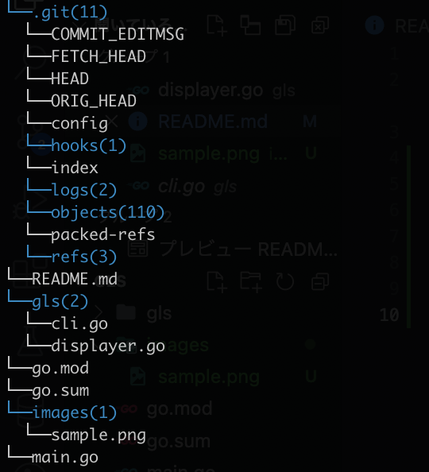

# gls
Using `ls` and `tree` nicely.

### Usage[WIP]
Display current dirs' files and dirs(with number of child files).

`lsd`

When you pass `-n [num]`, display nested dirs which depth is `n`

`lsd -n  2`

